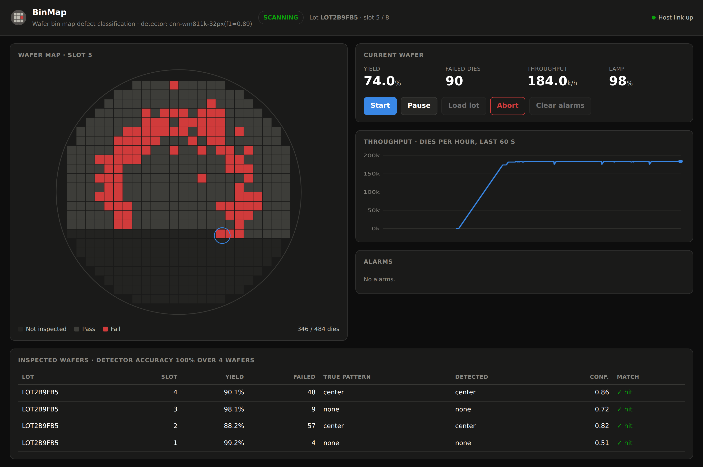

# Wafer Inspection Station

A working simulation of a semiconductor **optical inspection tool** and the
operator software that drives it: machine control, 10 Hz telemetry, live wafer
mapping, automatic defect-pattern classification, alarms and result storage.

The point of the project is the part that is hard to show on a CV: not a model
in a notebook, but a model inside a running machine, with an operator screen in
front of it and a database behind it.

 



*The operator console mid-scan: an edge-ring defect filling in die by die, live
throughput, and each finished wafer classified by the CNN against the
simulator's ground truth.*

## What it does

- **Simulated tool** - a cassette of wafers, a stage that walks every die,
  illumination that degrades, and faults (stage timeout, wafer misalignment)
  that put the machine into a real fault state and need operator action.
- **Operator console (HMI)** - live wafer map filling in die by die, stage
  position, yield and throughput tiles, a throughput chart, an alarm panel with
  severity, and machine controls.
- **Automatic Defect Classification** - every finished wafer is classified into
  a WM-811K pattern class (`none`, `center`, `donut`, `edge_ring`, `scratch`,
  `loc`) and scored against the simulator's ground truth.
- **Result store** - lots, wafers, yields, predictions and alarms in SQL, with a
  running detector-accuracy metric.

## Architecture

The system runs in two shapes from the same code. Which one starts is decided
by a single environment variable, `REDIS_URL`.

**Standalone** - one process, no services. What you use while developing:

```
 machine.py -> main.py (FastAPI) -> index.html
      |            |
 detector.py    db.py (SQLite file)
```

**Distributed** - `docker compose up`, and the shape a real installation has:

```
                    +-------------------+
                    |  tool container   |   owns the machine, runs the CNN
                    |  tool_service.py  |
                    +---------+---------+
                 events |     |     | results
                        v     |     v
      +-------------+  pub/sub|  +--------------+
      |    Redis    |<--------+  |  PostgreSQL  |
      +------+------+            +-------+------+
             | subscribe                 | queries
             v                           v
        +----------------------------------+
        |  web container(s)  main.py       |  --> browser
        +----------------------------------+
```

The split is not decoration. A real inspection tool is **one** machine: two
processes cannot both drive the stage. So the equipment side stays a single
instance, while the web tier holds no machine state at all and can therefore
run as several replicas behind a load balancer. Redis carries events one way
and operator commands the other; PostgreSQL holds the results both tiers agree
on.

Every layer sits behind a narrow interface, so each can be replaced on its own:
the heuristic detector for the CNN (done in milestone 2), SQLite for
PostgreSQL, the in-process bus for Redis, and - the point of the exercise - the
simulator for a real tool.

## Run it

With Anaconda (recommended - `run.bat` does all of this for you):

```bash
conda env create -f environment.yml
conda activate wafer-inspection
uvicorn backend.main:app --reload
```

Or into an existing environment, with plain pip:

```bash
pip install -r requirements.txt
uvicorn backend.main:app --reload
```

Open <http://127.0.0.1:8000>, press **Start**.

### Or the full stack, in containers

```bash
docker compose up --build
```

That starts four services - PostgreSQL, Redis, the equipment process and the
web tier - and the tool loads a 25-wafer lot and begins scanning by itself, so
<http://localhost:8000> is already moving when you open it.

```bash
docker compose ps          # health of each service
docker compose logs -f tool
docker compose down -v     # stop and delete the database volume
```

`GET /api/health` reports which shape is running:

```json
{"status":"ok","mode":"distributed","bus":"redis",
 "store":"postgresql","detector":"tool-service"}
```

Two images are built from one Dockerfile: the web image carries no ML stack at
all, and only the tool image installs CPU PyTorch and the checkpoint - so
scaling the web tier does not multiply a 1.5 GB image. Scaling it for real
(`--scale web=3`) also needs the fixed host port replaced by a proxy; the
services themselves are already stateless.


If the project sits on a network or shared drive where SQLite cannot lock
files, point the database somewhere local: `set WIS_DB_PATH=C:\temp\inspection.db`.

## Score the detector

```bash
python -m scripts.bench_detector 100
```

```
detector: heuristic-v1   wafers: 600   accuracy: 97.7%

                  none     center      donut  edge_ring    scratch        loc
none               100          0          0          0          0          0   recall 100%
center               0        100          0          0          0          0   recall 100%
donut                0          0        100          0          0          0   recall 100%
edge_ring            0          0          0        100          0          0   recall 100%
scratch              3          0          0          0         97          0   recall  97%
loc                  3          2          0          0          6         89   recall  89%
```

That number is honest but flattering: the simulator draws clean parametric
patterns, and hand-written radial features are very good at clean parametric
patterns. Real wafer maps are noisy, mixed-mode and unbalanced, which is
exactly where the heuristic falls over and a CNN earns its place - measuring
that gap is milestone 2.

## Milestone 2 - train the real detector

The heuristic never sees real data. To replace it:

```bash
pip install -r requirements-ml.txt          # install PyTorch from pytorch.org first
kaggle datasets download -d qingyi/wm811k-wafer-map -p data --unzip
python -m ml.data --size 32 --max-per-class 20000   # build the cached tensors
python -m ml.train --epochs 20                       # writes ml/checkpoints/wafer_cnn.pt
python -m ml.evaluate                                # heuristic vs CNN -> ml/RESULTS.md
```

Restart the server and the console header switches from `heuristic-v1` to the
CNN automatically - `backend/detector_cnn.py` loads the checkpoint if it
exists and falls back to the heuristic if it does not.

Two things about WM-811K that shape the code: only ~173k of the 811k wafers
carry a failure label, and about 85% of those are `none`. The cache subsamples
the majority class and the training loss is class-weighted; without both, the
model reaches high accuracy by predicting `none` for everything, which is why
`ml/evaluate.py` reports **macro F1** and not only accuracy.

## Results: what the model actually bought

Both detectors scored on the same held-out split of **6,834 real wafer maps**,
with identical input. Full per-class tables in [ml/RESULTS.md](ml/RESULTS.md).

| detector | accuracy | macro F1 |
|---|---:|---:|
| Heuristic, on **simulated** wafers | 0.977 | - |
| Heuristic, on **real** WM-811K | 0.476 | 0.235 |
| CNN, 32x32 input | 0.923 | 0.873 |
| CNN, 64x64 input | **0.933** | **0.877** |

The first two rows are the same code. Hand-written radial features score 97.7%
on the clean parametric patterns my simulator draws and 47.6% on real wafers -
that collapse is the honest reason to train a model, and it is why the
simulator keeps ground truth in the first place.

Where the heuristic fails is specific, not general:

- `edge_loc`, `random`, `near_full` - **F1 = 0.00**. It has no rule for them;
  a rule-based system can only find shapes somebody wrote a rule for.
- `center` - recall **0.04**. The rule wants most failures inside r < 0.35.
  Real centre defects are larger, noisier and off-centre, so the threshold
  almost never fires.
- `edge_ring` - recall 0.96 but F1 only 0.57: it labels far too many wafers
  `edge_ring`, because real wafers have failing dies near the edge for reasons
  that have nothing to do with a ring defect.

The CNN's own weak spot is `scratch` (F1 0.70) and, behind it, `loc` (0.80).
Both are consistent with the preprocessing rather than the model: a scratch is
often one or two dies wide, and nearest-neighbour downsampling to 32x32 breaks
a thin line into disconnected dots. Raising the input resolution is the next
experiment, not a bigger network.

### Experiment: was the `scratch` failure caused by preprocessing?

The 32x32 model's worst class was `scratch` (F1 0.70). Hypothesis: a scratch is
often one or two dies wide, and nearest-neighbour downsampling to 32x32 breaks a
thin line into disconnected dots - so the evidence is destroyed *before* the
model sees it. If that is true, raising the input resolution should help the
thin and small defects specifically, and leave the large ones alone.

Same architecture, same data, same 20 epochs - only the input resolution changed:

| class | 32x32 F1 | 64x64 F1 | change | n |
|---|---:|---:|---:|---:|
| **scratch** | 0.697 | **0.828** | **+0.131** | 180 |
| loc | 0.802 | 0.826 | +0.024 | 540 |
| none | 0.951 | 0.965 | +0.014 | 3000 |
| edge_loc | 0.861 | 0.865 | +0.004 | 779 |
| edge_ring | 0.973 | 0.975 | +0.002 | 1452 |
| random | 0.883 | 0.875 | -0.008 | 131 |
| center | 0.940 | 0.920 | -0.020 | 645 |
| donut | 0.893 | 0.854 | -0.039 | 84 |
| near_full | 0.857 | 0.784 | -0.073 | 23 |
| **overall** | 0.923 acc / 0.873 macro F1 | **0.933 acc / 0.877 macro F1** | | 6834 |

**The hypothesis holds for the class it was about.** `scratch` gains 13 points -
by far the largest move in the table - and `loc`, the other small-and-thin
class, gains as well. The large-area classes (`edge_ring`, `none`, `center`)
barely move, which is what should happen if resolution only mattered for thin
features.

**But the headline metric hides it.** Macro F1 rises only 0.873 -> 0.877,
because the gain on `scratch` is cancelled by losses on `near_full` (n=23) and
`donut` (n=84). With 23 test wafers, one wafer moves that class's F1 by about
four points, so those two deltas are inside the noise of a single run - they are
not evidence that 64x64 hurts those classes. Confirming that properly needs
several seeds per configuration, which is the honest next step rather than a
conclusion I can draw from one run.

The 64x64 model is the one the machine now loads, since `load_detector()` picks
the checkpoint with the best validation macro F1.

**Metric note.** 66% of the labelled wafers in this dataset are `none`, so a
model that predicts `none` for everything already scores about 0.66 accuracy.
Every number here is reported with macro F1 beside it for that reason.

## Roadmap

| Milestone | Content |
|---|---|
| 1 - done | Simulator, FastAPI + WebSocket, Vue console, SQLite store, heuristic ADC |
| **2 - done** | CNN trained on the real WM-811K dataset behind the same `Detector` interface; heuristic vs CNN on real data |
| **3 - done** | PostgreSQL + Redis, split tool/web services, Docker Compose |
| 4 | SECS/GEM equipment interface (SEMI E5/E30) and SPC control charts with Western Electric rules |

## Layout

```
backend/
  wafer.py         wafer geometry, WM-811K-style defect pattern generation
  machine.py       the simulated tool: states, telemetry, faults, scan loop
  detector.py      Detector interface + heuristic baseline classifier
  detector_cnn.py  the trained model, and checkpoint auto-selection
  bus.py           event/command bus: in-process or Redis
  runtime.py       wiring shared by both entry points
  tool_service.py  equipment-side process (owns the machine)
  db.py            SQLite store + factory
  db_postgres.py   PostgreSQL store, same interface
  main.py          FastAPI app: control API, WebSocket fan-out, static hosting
frontend/
  index.html    Vue 3 operator console (canvas wafer map + charts)
scripts/
  bench_detector.py   offline accuracy + confusion matrix on simulated wafers
ml/
  labels.py     shared 9-class vocabulary (WM-811K names -> snake_case)
  data.py       WM-811K loader, resize, class balancing, stratified split
  model.py      small CNN (~290k parameters)
  train.py      class-weighted training loop, checkpointing, per-class F1
  compat.py     real wafer map -> Wafer object, so the heuristic can be scored on it
  evaluate.py   head-to-head heuristic vs CNN -> RESULTS.md
```

## Notes

Wafer coordinates are normalised to a unit circle, dies are scanned in
serpentine order like a real stage, and the die grid, scan rate and lot size are
all parameters - so the same code drives a 26x26 demo wafer or a realistic map.
